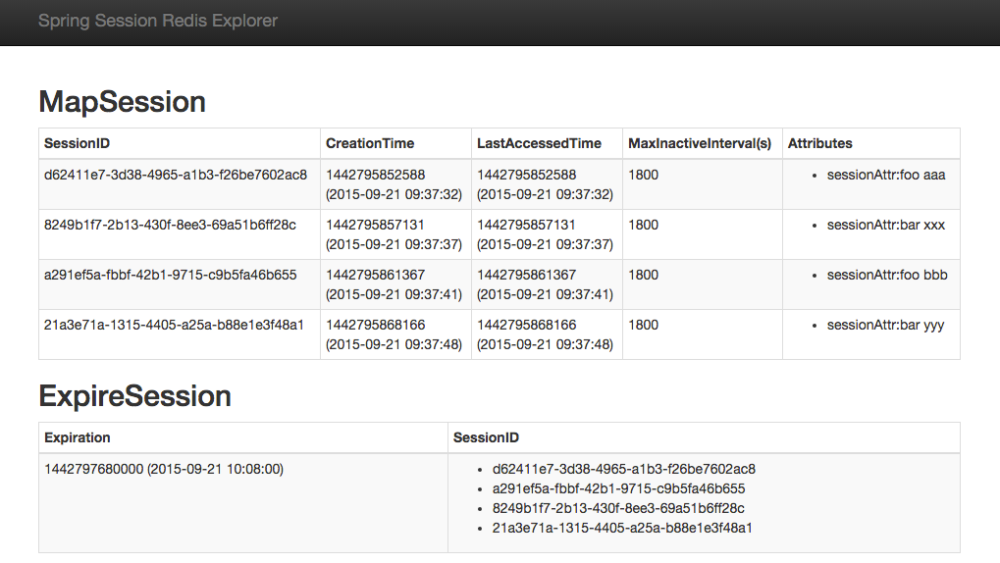

# Spring Session Redis Explorer

Explorer for Spring Session Data Redis



## Requirements

Java 8 (or later)

## Build

```
./gradlew build
```

## Run

```
java -jar build/libs/spring-session-redis-explorer.jar
```

Then access to http://localhost:8080/

## Configuration

|Configuration|Description|
|----|----|
|``spring.redis.host``|The hostname of Redis server|
|``spring.redis.port``|The port of Redis server|
|``server.port``|The listen port for incoming HTTP requests|

You can configure these parameters by several ways (command line arguments, ``application.yml`` file, OS environment variables, etc.)  
See http://docs.spring.io/spring-boot/docs/current/reference/html/boot-features-external-config.html more details.
